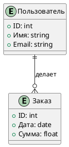

# Инструкция по заполнению шаблона

## 1. Описание
Добавьте краткое общее описание решения, которое вы разрабатываете. Это должно быть сжатое и ясное представление сути вашего проекта.

## 2. Главная цель
Определите основную цель доработки. Формулировка должна быть четкой и измеримой, чтобы можно было оценить успешность выполнения задачи.

## 3. Сущности
Составьте список всех сущностей, которые участвуют в данном решении. Это могут быть объекты, пользователи, системы и другие элементы, которые имеют отношение к вашему проекту.

## 4. Глоссарий
Создайте таблицу с терминами и их значениями, чтобы обеспечить ясность и понимание используемой терминологии. Пример таблицы:

| Термин                | Значение                                                                 |
|----------------------|--------------------------------------------------------------------------|
| Системные требования  | Разработка, связанная с решением какой-либо задачи в области информационных технологий |

## 5. Диаграммы
Если необходимо, добавьте диаграммы для визуализации связей между терминами и сущностями. Это поможет лучше понять структуру и взаимодействие элементов.

### 5.1 ERD Diagram (Chen)
Используйте нотацию ERD (Entity-Relationship Diagram) для представления сущностей и их взаимосвязей. Пример диаграммы в формате PlantUML:
НЕ ТЕ СВЯЗИ


### 5.2 ERD Diagram (Crow Foot)
https://www.lucidchart.com/pages/ru/erd-diagram - ШПОРА ТИПЫ СВЯЗИ В СВОРАЧИВАЕМОМ ВИДЕ
Добавьте диаграмму в нотации Crow Foot. Пример диаграммы в формате PlantUML:

```plantuml
@startuml
entity "Пользователь" {
  +ID: uid
  +Имя: string
  +Email: string
}

entity "Заказ" {
  +ID: uid
  +Дата: date
  +Сумма: float
}

entity "Товар" {
  +ID: uid
  +Название: date
  +Цена: int
}

Пользователь ||--o{ Заказ : делает
Заказ | -- { Товар : Состоит из
@enduml
```

### 5.3 Venn Diagram
При необходимости, добавьте диаграмму Венна для визуализации пересечений между различными сущностями или терминами. Пример диаграммы в формате PlantUML:

```plantuml
@startuml
!define VENN(x,y,z) <b>Venn Diagram</b> <br/> x <br/> y <br/> z

VENN("Сущность A", "Сущность B", "Общая часть")
@enduml
```

Эти примеры помогут вам создать необходимые диаграммы для вашего проекта.